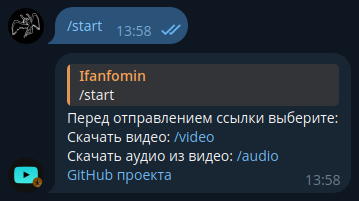
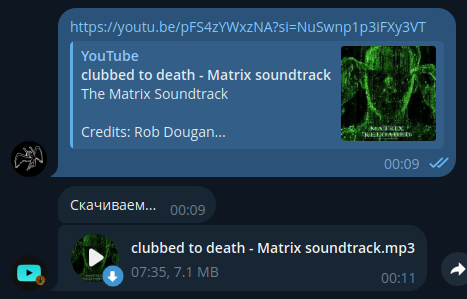
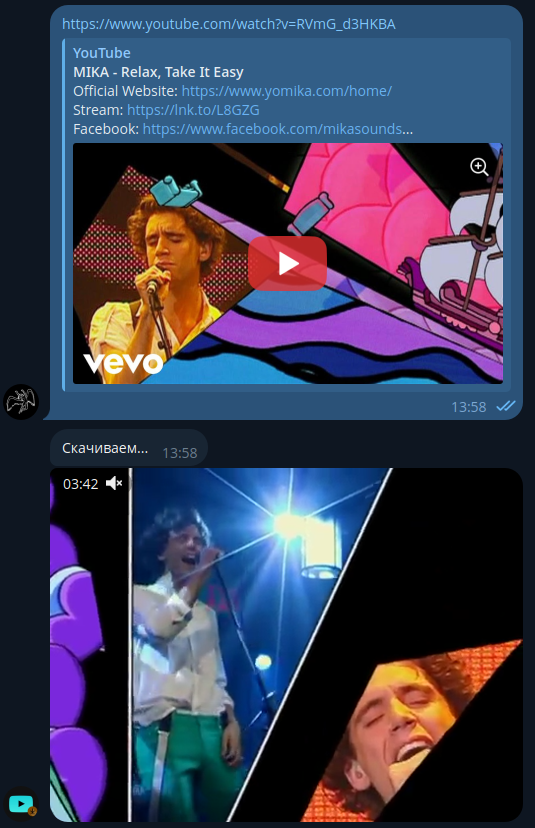

# Небольшой телеграм бот для скачивания видео и звука из видео из YouTube
### Доступен по ссылке: https://t.me/dwld_yt_video_audio_bot
### Как работает бот



1. Создаём config.py и указываем bot_token
2. Запускаем bot_main.py
3. В телеграме отправляем /start
4. Выбираем /video или /audio
5. Отправляем ссылку на видео
6. Ссылка передаётся в download_video_audio.py и скачивется файл
7. Файл отправляется в чат
8. Отправляем ещё ссылку или меняем режим скачивания
### Для инсталляции
```commandline
pip install -r requirements.txt
```
### Возможность скачивать из терминала
```commandline
python download_video_audio.py
```
Далее выбираете режим скачивания и отправляете ссылки на видео  
Видео скачиваются в корень проекта